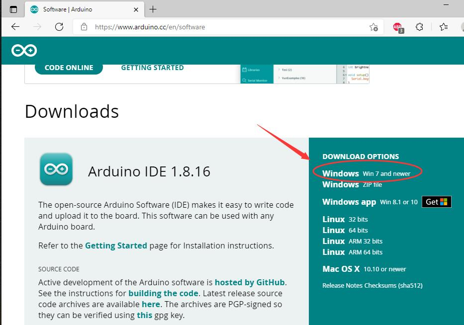
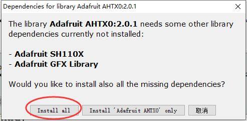
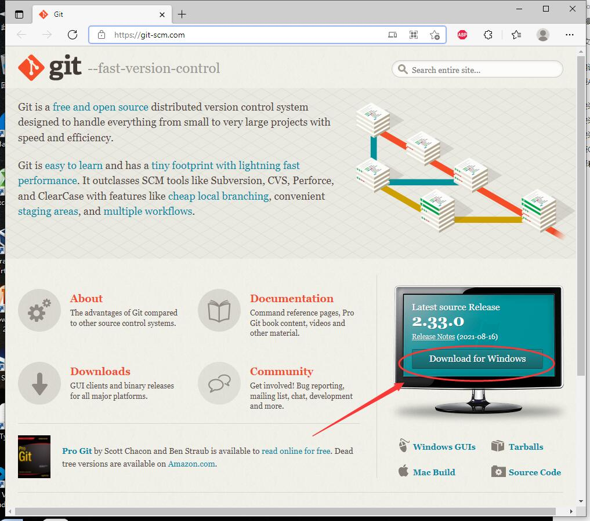
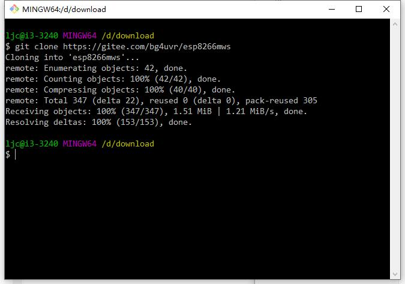
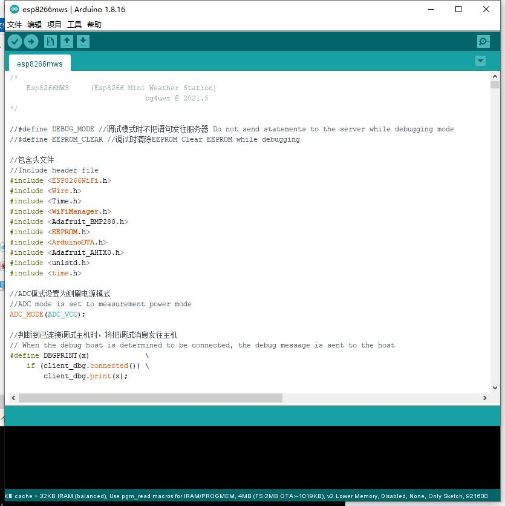
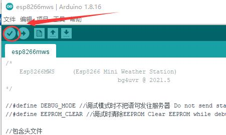
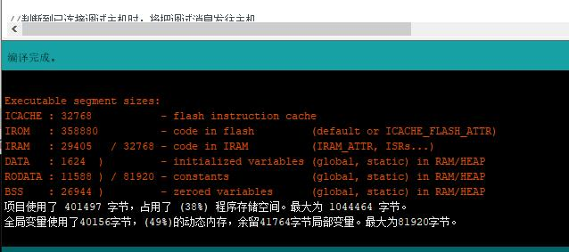
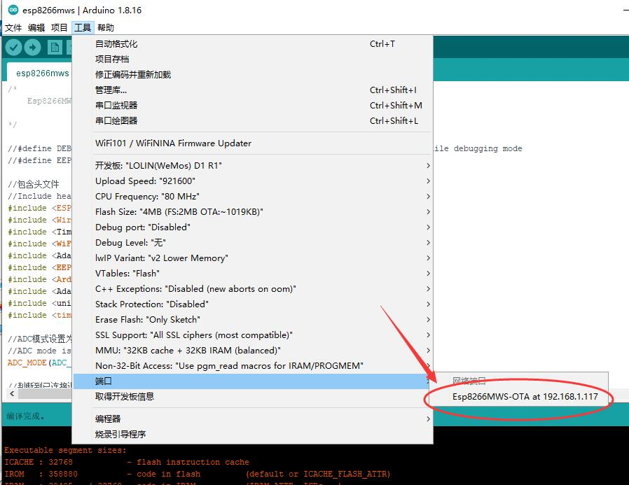

# 怎样编译源代码以及无线更新固件

自己来编译源代码，尝试更改、完善或增加相关功能，成就感可玩性一定更强，但因为步骤烦多对于从没接触过Arduino、esp8266的朋友来讲还是有点难度，这里作一个简要的说明。

## 安装Arudio IDE并配置编译环境

### 安装Arduino IDE

打开Arduino的官网 [Arduino - Home](https://www.arduino.cc/)，点击导航栏上的 “Software ”，然后点击右侧的链接下载

弹出的页面会出现捐款页面，点击"just download"继续，下载完成后，双击下载好的文件进行安装，一路点击"next"即可，最后安装完成点击"close"。

### 安装Esp8266支持

1. 双击桌面的arduino图标运行程序，在“文件”菜单中，选择“首选项”，在“附加开发板管理器网址”中，输入 `https://arduino.esp8266.com/stable/package_esp8266com_index.json` ，然后点击“好”保存退出。
2. 点击菜单“工具” - “开发板” - “开发板管理器”，向下滚动，选择“esp8266”，点击“安装”。
3. 因为以上步骤的服务器在境外，下载的速度可能会很慢甚至无法连接，这时可以手动下载安装包来安装，或者有条件可以尝试架梯子，具体方法网上自行搜索本文不再深入讨论。

### 安装所需库文件

点击菜单“工具” - "管理库"，安装下列库（可以在搜索框中输入库名部分文字即可搜索，注意有的库名字相似，请注意识别不要装错）：

`Adafruit_AHTX0`

`Adafruit_BMP280_Library`

`WiFiManager`

此处需要注意，有的库文件需要安装其他的关联库文件，需要选择“Install All”

至此，你的Arduino IDE环境配置完毕，已经可以编译源代码了，但是，为了下载及以后更新源代码方便，强烈建议再安装一个Git版本管理软件

## 安装Git

打开 [Git (git-scm.com)](https://git-scm.com/)，直接点击右侧的“Download for Windows”进行下载

下载完成后，双击下载到的Git-2.33xxxx.exe文件进行安装，安装过程中所有需要选择的地方选默认即可。

## 编译和下载

1. 用资源打开准备放置项目文件的目录，空白处点击右键，选择“Git Bash Here”，输入：

   `git clone https://github.com/bg4uvr/esp8266mws`  或

   `git clone https://gitee.com/bg4uvr/esp8266mws` （国内建议使用，速度会比上面的快）

   git会从远程的git仓库下载相关代码，完成后是这样：

   

   

2. 现在在你刚才选择的目录下，已经多出了子目录 esp8266mws，进入子目录，双击esp8266mws.ino，会自动启动Arduino IDE打开源代码文件

   

   

3. 点击菜单“工具” - "开发板" - “ESP8266 boards”，选择“LOLIN(WeMos) D1 R1”。(这不是唯一可以正确工作的选择，但不熟悉时，为了描述的统一，这样选择即可。)

4. 然后按此图进行开发板设置（某宝上的esp8266板子FLASH基本都是4MB的）

   

5. 此时可以点击工具栏上的对号图标进行编译验证

   

6. 如果Arduino IDE的开发板管理器和库文件都安装正确，那么编译的过程大约需要1-2分钟完成，在窗口的底部将显示编译结果，内容是各种空间的使用情况

   

7. 此时，你可以用USB线连接你的开发板了。板子上的USB转串口芯片，有CH340和CP2102两种，请自行安装对应的驱动，相打开设备管理器确认正确的串口号。

8. 在第4步中的截图上，“端口”处选择你的串口。点击菜单栏上的右箭头图标，就可以编译并且下载固件到板子上了。

## 无线固件更新（OTA）

1. 完成上面的步骤后，你的板子固件已经烧写完成，经过配置后即可正常工作。如果想检查我是否已经更新了远程仓库的软件，可以在资源管理器中，右键点击项目文件夹，选择“Git Bash Here”，输入`git pull`并回车，如果远程存在更新那么你的文件将会同步更新。

2. 源代码更新后，如果想要更新你板子的固件，那么打开你的网络调试工具，并正确设置后（请参看readme.md中的说明），板子在唤醒后会自动连接到你的调试软件，并在窗口中显示相关的信息。

3. 此时保持调试软件的窗口打开，并且不能关闭已建立TCP连接。

4. 用Arduino IDE打开esp8266mws.ino，等待一会儿（大约不到1分钟），在Arduino IDE的菜单“工具”-开发板的“端口”处，将会多出来一个网络端口，鼠标单击选择这个端口

   

5. 此时点击工具上的右键头下载图标，就可以把新版本的代码编译好，并且无线下载到板子上了。注意，在wifi信号偏弱的情况下，无线下载固件的过程可能会出错，重试即可。

