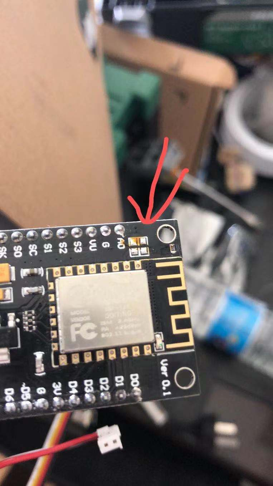
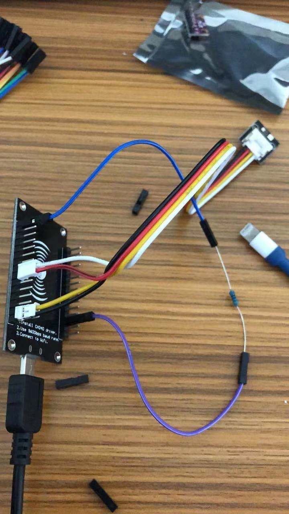

## newbie-setup.md
持续更新，慢慢完成。
### 说明：本文在bg4uvr大佬的热心指导下下完成。
感谢他的源码，虽然国内已经不适合气象站的存在了。但是无线电玩的不就是折腾吗？
本文不涉及太阳能板和电池。
## 记录最重要的一点
A0针脚的2个贴片电阻一定要去掉，否则固件刷完重启后无法正常启动
> 此处放针脚被吹掉后的图 
 
  

## 一、硬件准备
1、Esp8266 1个 约12元淘宝包邮
2、AHT20+BMP280一体化传感器 1个 约10元包邮
3、470欧姆电阻 1个 没有的话就买传感器顺路买个电阻包
4、杜邦线 1根
5、风枪或者电烙铁，用于去掉贴片电阻
## 二、软件准备
### 1、ch340 驱动
此处放驱动文件（windows7 64bit）
### 2、乐鑫 Flash 下载工具
https://www.espressif.com/zh-hans/support/download/other-tools
### 3、网络调试工具
http://free.cmsoft.cn/download/cmsoft/assistant/netassist4.3.29.zip

##三、调试步骤
### 使用风枪吹掉A0 针脚的2个贴片电阻
260度加热几十秒后，用镊子随便推下就掉了

### 0、按照readme.md说明连接好传感器
简单说明：
 (1)连接传感器，传感器送的线缆，一端用小刀割开就可以牢牢插紧。
    esp8266              aht20+bmp280传感器
    D5(gpio14) .......     SCL
    D6（gpio12）........    SDA
    3.3v    ........       VDD
    G       ........       GND
 （2）在D0和RST之间连接470欧姆电阻
    过程略。我用2根杜邦线连接，后期会用热熔胶或焊锡之类固定
     
     
      

### 1、刷入固件
参考bg4uvr设置，这里注意下右下角波特率我使用的是本机上的115200

### 2、配置wifi
过程：（1）刷机后重新给8266上电或者按reset完成重启
     （2）观察8266主板上的蓝色led灯是否亮起，如果不亮说明刷机失败，或者那2各贴片电阻没去掉

注意：8266的wifi天线性能差，不要距离路由器太远，否则会连不上wifi

### 3、检查路由器的lan口ip地址是否为192.168.1.1
很重要，因为代码里指定里服务端ip为192.168.1.125

### 4、网络调试工具中配置呼号、坐标等信息
