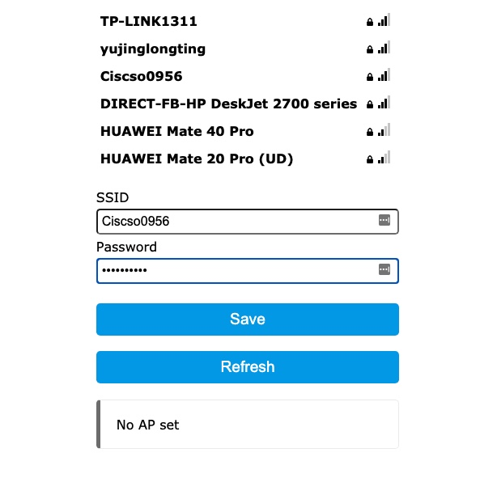
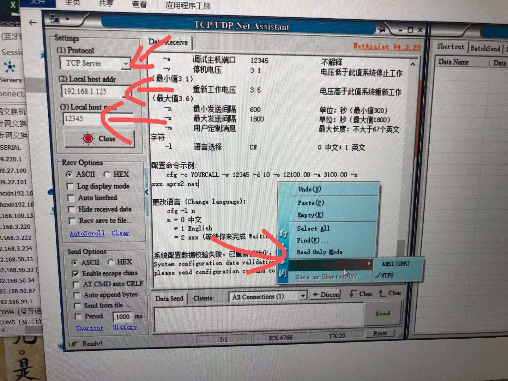

## newbie-setup.md
持续更新，慢慢完成。
### 说明：本文在bg4uvr大佬的热心指导下下完成。
感谢他的源码，虽然国内已经不适合气象站的存在了。但是无线电玩的不就是折腾吗？
本文不涉及太阳能板和电池。
## 记录最重要的一点
A0针脚的2个贴片电阻一定要去掉，否则固件刷完重启后无法正常启动
> 此处放针脚被吹掉后的图 
 
  


## 一、硬件准备
1、Esp8266 1个 约12元淘宝包邮
2、AHT20+BMP280一体化传感器 1个 约10元包邮
3、470欧姆电阻 1个 没有的话就买传感器顺路买个电阻包
4、杜邦线 1根
5、风枪或者电烙铁，用于去掉贴片电阻
## 二、软件准备
### 1、ch340 驱动
此处放驱动文件（windows7 64bit）
### 2、乐鑫 Flash 下载工具
https://www.espressif.com/zh-hans/support/download/other-tools
### 3、网络调试工具
http://free.cmsoft.cn/download/cmsoft/assistant/netassist4.3.29.zip

##三、调试步骤
### 使用风枪吹掉A0 针脚的2个贴片电阻
260度加热几十秒后，用镊子随便推下就掉了

### 0、按照readme.md说明连接好传感器
简单说明：
 (1)连接传感器，传感器送的线缆，一端用小刀割开就可以牢牢插紧。
 
    esp8266              aht20+bmp280传感器
    D5(gpio14) .......     SCL
    D6（gpio12）........    SDA
    3.3v    ........       VDD
    G       ........       GND
    
 （2）在D0和RST之间连接470欧姆电阻
    过程略。我用2根杜邦线连接，后期会用热熔胶或焊锡之类固定
     
     
  


### 1、刷入固件
参考bg4uvr设置，这里注意下右下角波特率我使用的是本机上的115200


### 3、检查路由器的lan口ip地址是否为192.168.1.1
很重要，因为代码里指定里服务端ip为192.168.1.125，不修改是给自己添乱

### 2、配置wifi
过程：
（1）刷机后重新给8266上电或者按reset完成重启
（2）观察8266主板上的蓝色led灯是否亮起，如果不亮说明刷机失败，或者那2各贴片电阻没去掉

        注意：8266的wifi天线性能差，不要距离路由器太远，否则会连不上wifi
 （3）连接wifi
        找到一个名为“Esp8266MWS-SET”的未加密无线网，连接后会自动弹出一个网页窗口如下图。如果没有，用浏览器直接访问这个esp的wifi网关。


（4）点击加入你自己家的路由器，然后输入密码



（5）提示保存成功够，重启esp8266
    注意8266离wifi近一点，如果太远（5米以上）就会无法加入你设定的家庭wifi，这时表现为又出现“Esp8266MWS-SET”的ssid。

### 4、网络调试工具中配置呼号、坐标等信息
（1）首先配置你自己的电脑ip地址为192.168.1.125
    wifi的话就配无线网卡上
    有线连接就配有线网卡
    
（2）运行下载的网络调试工具
    为确保软件正常工作，请做一下设置
    a、软件语言更改为english（软件左上角点击倒三角符号，在lanauage里选english）
    b、软件右方空白地方点击右键，编码选择UTF8
     然后按下图红色箭头设置，依次选择
     c、protocol 为TCP
     d、local host 192.168.1.125
     e、Local port 设置为12345
     f、open下方按图示选择对应选项
     最后点击open
     
     
 （3）一旦esp8266加入指定wifi并获得正确ip地址（格式192.168.1.x），那么就会自动连接调试软件，并在软件窗口显示配置信息
 
###   5、发送aprs设置参数

命令如下
`配置命令示例:
    cfg -c YOURCALL -w 12345 -d 10 -o 12100.00 -a 3100.00 -s asia.aprs2.net`
    

```>     配置命令格式说明：
> 
>     cfg -c callsign -w password -o lon -a lat -s serveradd [其他可选参数]
> 
>     参数    含义            格式                说明
> 
> 必设参数:
>     -c      呼号            BGnXXX              个人台站的呼号
>     -w      验证码          12345               这个验证码的来源不解释
>     -o      经度            12106.00            格式：dddmm.mm，东正西负
>     -a      纬度            3153.00             格式：ddmm.mm，北正南负
>     -s      APRS服务器地址  xxx.aprs2.net       不解释
> 可选参数：
    -d      SSID            13                  SSID(支持2位字母的新规则)
    -p      APRS服务器端口  14580               不解释
    -g      调试主机地址    192.168.1.125       用于调试、配置及监控的主机内网IP
    -e      调试主机端口    12345               不解释
    -v      停机电压        3.1                 电压低于此值系统停止工作（最小值3.1）
    -r      重新工作电压    3.5                 电压高于此值系统重新工作（最大值3.6）
    -n      最小发送间隔    600                 单位：秒（最小值300）
    -x      最大发送间隔    1800                单位：秒（最大值1800）
    -m      用户定制消息(新版已被删除)                        最大长度：不大于67个英文字符
    -l      语言选择        CN                  0 中文；1 英文
```
