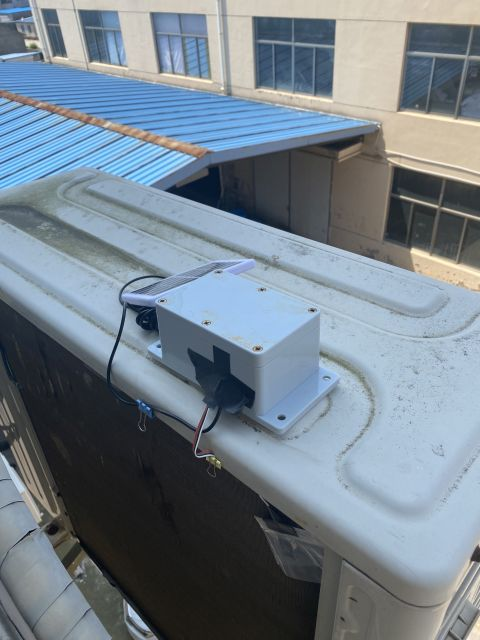
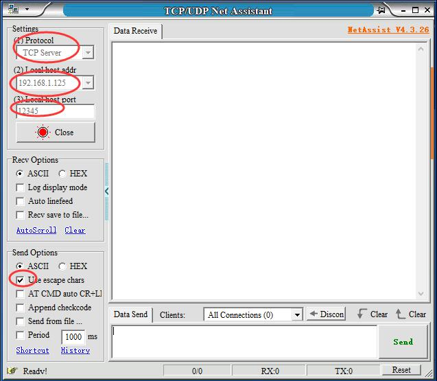

# Esp8266 Mini Weather Station

The English instructions are at the bottom

# Esp8266 迷你气象站

## 简介

这个小制作是我学习esp8266 arduino的第一个小实验，它使用常见的esp8266模块（如NODEMCU、WEMOS等），外接两只I2C总线的气压温度湿度传感器，来实现了**简单的**业余无线电爱好者使用的APRS气象站功能（说是简单是因为它并没有风向、风速和雨量功能，而且后期也没有加入这些功能的打算，原因是这类传感器价格比较贵，不太适应瞎折腾玩 :-p）。实现类似功能的开源小制作估计也有不少，相比较而言，我这个的最主要特点以下几个：

- 简单

  整个制作主要使用了3个模块，CN3791太阳能充电模块、NODEMCU板、ATH20+BMP280模块。

- 省电

  由于让ESP8266工作于休眠间歇状态，并且使用了高效的太阳能充电控制模块，所以它仅使用一片标称6V/1.2W的小太阳能电池板来供电（其实更小的也可以），外加一只18650锂电池来储能，基本上可以实现全候不间断工作。我的整个装置放在房子的北侧，除了夏季的清晨和傍晚，阳光都无法直射，装置只靠天空的散射光即可充分充电，即使是阴天也是如此。

- 便宜

  我实际制作的总价：ESP8266模块10.58元  + 1.2W太阳能板9.9元 + 18650(1200mAh)2.9元 + 18650电池盒1.3元 + AHT20+BMP280传感器模块10元 + 塑料防水外壳10元 + CN3791太阳能充电模块12.3元 + 锂电保护板1.04元 = **58.02元**。

- 配置

  方便使用网络调试工具，通过命令行的方式可以配置全部的工作参数。

- 多语言支持

  代码在编写时考虑了多语言支持，可以非常方便地加入其他语言支持，目前仅支持中文和英文，如果您精通其他语言，欢迎加入其他语种的支持，同时也欢迎修改代码中的英文表述和语法错误。

我自己制作小气象站的运行状态可以在这里看到

[BG4UVR-13 的APRS/CWOP气象报告 – Google Maps APRS](https://aprs.fi/weather/a/BG4UVR-13)

## 重要提示

**为保护APRS网络的正常运行秩序，在此特别声明及提醒注意以下几点：**

- **本制作仅适合有合法业余电台呼号的业余无线电爱好者参考制作，如果您不符合此条件，则代码仅供参考，一定不可以实际制作安装使用。**
- **这个制作在使用的时候，需要设置相关的APRS服务器地址、端口、个人呼号和验证码，这些信息请自行准备，我不提供关于此方面的信息。**
- **如果您基于本代码重新修改发布您自己的作品时，也强烈建议千万不可将上述信息内置于您的代码中。**

## 硬件连接

由于电路结构非常简单，所以我不准备专业画图，直接用文字说明好了。

- 供电电源

  太阳能电池接入CN3791充电模块，充电模块的输出连接锂电保护板和18650电池，保护板的输出直接接在NODEMCU板的3.3V电源和GND地上（虽然esp8266的官方不建议锂电直接供电，但权衡利弊后我觉得这样接最合适了）。

- 传感器

  我的AHT20+BMP280模块是一体的，但即使使用两个单独的模块也一样，因为I2C总线本身就是支持多设备的，SDA接GPIO12（D6），SCL接GPIO14（D5）。**需要注意的是，BMP280模块，根据模块硬件接线不同，可能有两种硬件地址，如果你的代码无法检测到它，请把代码中bmp.begin()更改为bmp.begin(BMP280_ADDRESS_ALT)。**

- 电池电压检测

  由于是使用esp8266 ADC的VCC检测方式，所以需要拆除NODEMCU板A0脚上外接的两只电阻，一般是100K和220K的。

- 休眠自动唤醒

  GPIO16（D0）通过470欧左右的电阻连接到RST脚，使用电阻的目的是保护IO端口，以免在意外的情况下烧毁IO管脚。

## 代码编译与固件烧写

熟悉arduino的朋友，可以直接使用Arduino IDE，在安装好相应库的情况下，直接进行编译和下载。代码中已经包含了OTA的代码，第一次烧写完成后，后面可以直接OTA来烧写，一些细节见下面的使用方法。

不熟悉arduino的朋友，可以下载乐鑫官方的的固件下载工具，目前的最新版官方地址如下：

https://www.espressif.com/sites/default/files/tools/flash_download_tool_v3.8.7_0.zip

下载好解压完成后，双击主程序文件运行，如果是windows10的操作系统，会弹出一个警告，选择“仍要运行”即可。出现的窗口中，Chip Type选择 ESP8266，Work Mode选择“develop”，然后选择好已编译好的.bin文件，选择好你自己的串口号，其他按下图中的设置，点击 start 即可下载。

## 使用方法

- 连接WiFi

  硬件线路连接完毕，并且烧写固件后，初次使用时，需要设置WiFi信息。方法如下：

  如果固件已经烧写成功，系统上电后，NODEMCU板上的蓝色LED应该已经点亮。此时使用手机或有无线网的电脑，搜索无线网络，将能找到一个SSID为“Esp8266MWS-SET”的未加密无线网，点击连接成功后，系统应该会自动打开浏览器，并显示周围无线网络SSID名称的列表，选择你自己无线网并且输入正确的密码后，NODEMCU板就应该会自动连接上你的WiFi了，这个设置工作只需要完成一次即可，你所设置的WiFi信息会自动保存，下次上电可以直接连接你的网络。

- 配置参数

  使用你所常用的网络调试工具，我用的是下面这个免费软件（菜单支持中文和英文显示）：

  http://free.cmsoft.cn/download/cmsoft/assistant/netassist4.3.29.zip

  首先需要设置你电脑的IP地址为 192.168.1.125 ，并且你的无线路由器需要处于同一网段，这个地址及网段后期可以更改，但第一次使用的时候必须这样设置，它是一个默认的初始设置。在确认你的电脑IP已经更改完成，并且无线网也是同一网段后，打开上面的网络调试软件按下图设置，并点击打开：

  

  如果你的电路已经成功工作，那么它应该马上就会显示相应的连接消息。至于配置命令的具体使用，窗口会显示详细的说明，按说明设置即可。

- 正常运行
  1. 使用命令行配置好系统后，系统就已经正常运行了。在打开网络调试工具并且已经esp8266已经连接在电脑的情况下，窗口中会显示相应的运行状态。此时电路是一直工作的，不会进入休眠状态，此时OTA系统是运行的，可以直接使用Arduino IDE进行代码更新（更新后WiFi的设置以及所有的配置参数都是不变的，不需要重新设置）。
  2. 如果关闭了电脑上的网络调试工具，或者点击关闭来结束了网络连接，那么esp8266马上会进入节能休眠状态。系统将根据电池电压，以及配置参数中设置的发送间隔参数，来自动计算唤醒时间，一但唤醒时间到达，系统将自动进行一次测量，并送相应数据到APRS服务器，然后再次进入休眠状态。
  3. 当电池电压低于设置的“停止工作电压”时，系统会不再发送数据，但会周期性的唤醒，来检测电压，直到电压上升到“重新工作电压"值以上时，系统会再次正常间隔运行。
  4. 因为系统处于间歇运行状态，每次工作时间大约只有10秒钟，所以如果需要进行空中固件更新，那么只要打开网络调试软件的服务器状态，等待系统再次工作时，就会自动连接上电脑，此时就可以进行空中更新操作了。

## 常见问题

- 待补充~

  

# ENGLISH

因为我的英文不好，所以在阅读外国朋友的代码时特别麻烦，正因为如此，我特别能理解外国朋友看到中文介绍和代码注释时的感觉。所以我特别使用电脑翻译了全部的说明文字和代码的注释内容，以方便外国朋友。但我知道电脑翻译的正确性和准确性是极差的，所以英文的内容仅是无奈情况下的参考。同时也欢迎有能力的朋友能帮忙完善这些英文内容，可以通过发pull requests来更新维护，在此表示感谢~

Because my English is not good, it is very difficult for me to read the code of foreign friends. Because of this, I can understand the feeling of foreign friends when they see the Chinese introduction and code comments. So I specially use the computer to translate all the explanatory text and the code annotation content, for the convenience of foreign friends. But I know that the correctness and accuracy of computer translation is very poor, so the English content is only a helpless case of reference. We also welcome the ability of friends to help improve the English content, you can send pull requests to update maintenance, thanks~

## INTRODUCTION

This small production is my first small experiment to learn ESP8266 Arduino. It uses common ESP8266 modules (such as Nodemcu, Wemos, etc.) and is connected with two pressure, temperature and humidity sensors of I2C bus.To implement the **simple** APRS weather station feature used by amateur radio operators (simple because it doesn't have wind, wind, and rainfall features, and there are no plans to add them in the future because they are expensive and not easy to play around with: -P).It is estimated that there are many small open source productions that can achieve similar functions. In comparison, the main features of this one are as follows:

- Simplicity

  The whole production mainly uses three modules, CN3791 solar charging module, NODEMCU board, ATH20+BMP280 module.

- Save electricity

  By keeping the ESP8266 in hibernation and using a highly efficient solar charging control module, it uses only a small 6V/1.2W solar panel to power it (or even smaller), plus an 18650 lithium-ion battery to store the energy, so it can operate almost continuously. My entire installation is on the north side of the house. Except in the summer mornings and evenings, there is no direct sunlight, and the device is fully charged by the scattered light from the sky, even on cloudy days.

- cheap

  The total price of my actual production: ESP8266 module 10.58 yuan + 1.2W solar panel 9.9 yuan + 18650(1200mAh)2.9 yuan + 18650 battery box 1.3 yuan + AHT20+BMP280 sensor module 10 yuan + plastic waterproof shell 10 yuan +CN3791 solar charging module 12.3 yuan + lithium electric protection plate 1.04 yuan = **58.02 yuan(RMB)**

- Convenient configuration

  With the network debugging tool, you can configure all the working parameters from the command line.

- Multilingual support

  language support. At present, it only supports Chinese and English. If you are proficient in other languages, you are welcome to add support in other languages, and you are also welcome to modify the English expression and syntax errors in the code.

The operation status of my own small weather station can be seen here

[BG4UVR-13 的APRS/CWOP气象报告 – Google Maps APRS](https://aprs.fi/weather/a/BG4UVR-13)

## IMPORTANT NOTE

**IN ORDER TO PROTECT THE NORMAL OPERATION ORDER OF THE APRS NETWORK, WE HEREBY DECLARE AND REMIND YOU OF THE FOLLOWING POINTS:**

- THIS PRODUCTION IS ONLY SUITABLE FOR LEGAL AMATEUR RADIO CALL SIGN AMATEUR REFERENCE PRODUCTION, IF YOU DO NOT MEET THIS CONDITION, THEN THE CODE IS FOR REFERENCE ONLY, MUST NOT ACTUALLY MAKE INSTALLATION USE.

- WHEN USING THIS PRODUCTION, YOU NEED TO SET THE RELEVANT APRS SERVER ADDRESS, PORT, PERSONAL CALL SIGN AND VERIFICATION CODE. PLEASE PREPARE THESE INFORMATION BY YOURSELF, I WILL NOT PROVIDE INFORMATION ABOUT THIS.
- IF YOU MODIFY AND DISTRIBUTE YOUR OWN WORK BASED ON THIS CODE, IT IS STRONGLY RECOMMENDED THAT YOU DO NOT INCLUDE THE ABOVE INFORMATION IN YOUR CODE.

## HARDWARE CONNECTION

Because the structure of the circuit is very simple, I will not draw it professionally, but just use words to explain it.

- Power supply

  The solar cell is connected to the CN3791 charging module, and the output of the charging module is connected to the lithium protection plate and the 18650 battery. The output of the protection plate is directly connected to the 3.3V power supply of the Nodemcu plate and the GND (although ESP8266 official does not recommend direct power supply from lithium, I think this connection is the most appropriate after weighing the advantages and disadvantages).

- sensor

  My AHT20+BMP280 module is integrated, but even using two separate modules is the same, because the I2C bus itself supports multiple devices, with SDA connected to GPIO12 (D6) and SCL connected to GPIO14 (D5). **Note that the BMP280 module, depending on the hardware wiring of the module, may have two kinds of hardware addresses. If your code cannot detect this, change the bmp.begin() in the code to bmp.begin(BMP280_ADDRESS_ALT).**

- battery voltage

  As ESP8266 ADC VCC detection method is used, it is necessary to remove the two external resistors on the A0 pin of Nodemcu plate, generally 100K and 220K.

- Sleep automatically wake up

  The GPIO16 (D0) is connected to the RST pin through a resistor of around 470 Ohm. The purpose of using resistors is to protect the IO port from accidental burning of the IO pin.

## CODE COMPILE AND FIRMWARE FLASH

If you are familiar with Arduino, you can directly use the Arduino IDE and compile and download it with the corresponding libraries installed.OTA code has been included in the code. After the completion of the first burn, OTA can be directly burned later. For some details, please refer to the following usage method.

If you are not familiar with Arduino, you can download the official firmware download tool of ESPRESSIF. The current official address of the latest version is as follows:

https://www.espressif.com/sites/default/files/tools/flash_download_tool_v3.8.7_0.zip

After downloading the decompression, double-click the main program file to run. If it is the Windows 10 operating system, a warning will pop up and select "still want to run".In the window that appears, select the Chip Type ESP8266, Work Mode "develop", then select the compiled.bin file, select your own serial port number, other Settings as shown in the following figure, and click Start to download.

## HOW TO USE

- Connect to WiFi

  After the hardware wiring is connected and the firmware is burned, the WIFI information needs to be set for the first time.Here's how: 

  If the firmware has been burned successfully, the blue LED on the Nodemcu board should be lit when the system is powered on.At this time, use a mobile phone or a computer with wireless network, search for wireless network, and you will find an unencrypted wireless network with SSID of "ESP8266MWS-SET". After clicking on the successful connection, the system should automatically open the browser, and display the list of SSID names of surrounding wireless networks. After selecting your own wireless network and entering the correct password,The Nodemcu board should automatically connect to your WiFi. This setup only needs to be done once. The WiFi information you set will be saved automatically and you can connect directly to your network the next time you turn on the power.

- Configuration parameters

  Use your commonly used network debugging tools, I used the following free software (menu support Chinese and English display) :

  http://free.cmsoft.cn/download/cmsoft/assistant/netassist4.3.29.zip

  First of all, you need to set the IP address of your computer as 192.168.1.125, and your wireless router needs to be in the same network segment. This address and the network segment can be changed later, but it must be set like this when you first use it. It is a default initial setting.After confirming that your computer's IP has been changed and that the wireless network is the same network segment, open the above network debugging software and click Open as shown in the following figure:

  

  If your circuit has worked successfully, it should immediately display the appropriate connection message. As for the specific use of the configuration command, The window displays a detailed description, you can press the instructions to set.

- Normal use
  
  1. After the system is configured using the command line, the system is running normally.When the network debugging tool is open and ESP8266 is already connected to the computer, the corresponding running status will be displayed in the window.At this time, the circuit is working all the time and will not enter the hibernation state. At this time, the OTA system is running, and the code can be updated directly with the Arduino IDE (after the update, the setting of WiFi and all configuration parameters remain unchanged, and there is no need to reset).
  2. If you turn off the Network Debugger on your computer, or click Close to end your network connection, ESP8266 will immediately enter the Energy-saving Sleep state.The system will automatically calculate the wake-up time according to the battery voltage and the transmission interval parameters set in the configuration parameters. Once the wake-up time arrives, the system will automatically make a measurement and send the corresponding data to the APRS server, and then enter the sleep state again.
  3. When the battery voltage is lower than the set "stop working voltage", the system will no longer send data, but will periodically wake up to detect the voltage, until the voltage rises above the value of "restart working voltage", the system will run again at normal intervals.
  4. Because the system is running intermittently, each working time is only about 10 seconds, so if you need to update the firmware in the air, as long as you open the server state of the network debugging software, waiting for the system to work again, it will automatically connect to the computer, then you can carry out the air update operation.

## FAQ

- To be added ~

