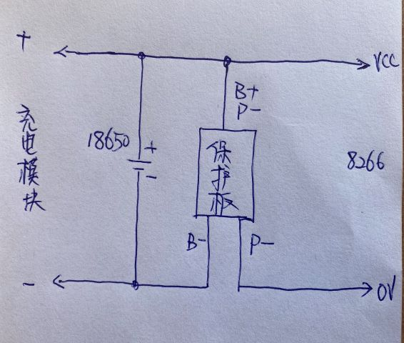

# Esp8266 迷你气象站

**Esp8266 Mini Weather Station**

**鉴于相关政策法规的原因，本资料仅限学习Arduino编程及APRS相关知识使用，制作使用者需要自行承担一切后果，特此声明！！！**

本代码在以下地址同步更新：

​    <https://github.com/bg4uvr/esp8266mws>
​    <https://gitee.com/bg4uvr/esp8266mws> （国内建议使用）

## 简介

这是我学习ESP8266 Arduino的一个实验，它使用常见的esp8266实验板（如NODEMCU、WEMOS等），外接两只I2C总线的气压温度湿度传感器，来实现了简单的APRS气象站功能（说是简单是因为它并没有风向、风速和雨量功能，而且后期也没有加入这些功能的打算，原因是这类传感器价格比较贵，不太适应瞎折腾玩 :-p）。实现类似功能的开源小制作估计也有不少，相比较而言，我这个的最主要特点以下几个：

- 简单
  整个制作主要使用了3个模块，CN3791太阳能充电模块、NODEMCU板、AHT20+BMP280模块。

- 省电
  由于让ESP8266工作于休眠间歇状态，并且使用了高效的太阳能充电控制模块，所以它仅使用一片标称6V/1.2W的小太阳能电池板来供电，外加一只18650锂电池来储能，基本上可以实现全候不间断工作。我的整个装置放在房子的北侧，除了夏季的清晨和傍晚，阳光都无法直射，装置只靠天空的散射光即可充分充电，即使是阴天也是如此。

- 便宜
  我实际制作的总价：ESP8266模块10.58元  + 1.2W太阳能板9.9元 + 18650(1200mAh)2.9元 + 18650电池盒1.3元 + AHT20+BMP280传感器模块10元 + 塑料防水外壳10元 + CN3791太阳能充电模块12.3元 + 锂电保护板1.04元 = **58.02元**。

- 配置
  方便使用网络调试工具，通过命令行的方式可以配置全部的工作参数。

- 多语言支持
  代码在编写时考虑了多语言支持，可以非常方便地加入其他语言支持，目前仅支持中文和英文，如果您精通其他语言，欢迎加入其他语种的支持，同时也欢迎修改代码中的英文表述和语法错误。

## 重要提示

为保护APRS网络的正常运行秩序，在此特别声明及提醒注意以下几点：

- 本制作仅适合有合法业余电台呼号的业余无线电爱好者参考制作，如果您不符合此条件，则代码仅供参考，一定不可以实际制作安装使用。
- 这个制作在使用的时候，需要设置相关的个人呼号和验证码，这些信息请自行准备，我不提供关于此方面的信息。
- 如果您基于本代码重新修改发布您自己的作品时，也千万注意不要将上述信息内置于您的代码中。

## 硬件连接

由于电路结构非常简单，此处只画个简单的示意图（注意上面没有画太阳能电池板、充电控制板和锂电保护板）

- 供电电源
  <mark>按以下方案操作请注意仔细阅读，细心操作，不然有芯片烧毁的风险！</mark>
  太阳电池能板输出接到CN3791太阳能充电控制模块的输入端，模块的输出端与已连接保护板的18650电池并联，然后直接接在NODEMCU板的3.3V电源和GND地上。此处容易粗心大意犯错，特补一个示意图：
    

  补充说明几点：
    1. 某宝上买到的CN3791模块，一般板上默认的电流检测电阻为50毫欧，需要把这个电阻更换为0.51欧，充电电流就变成了大约 0.12V / 0.51R = 235mA，经实际使用验证效果良好。
    2. 如果未使用太阳能充电控制模块，而直接采取了太阳能板串二极管的做法，那么你应该把电池输出接到NODEMCU板的5V电源端口。因为如果你的电池开路，或者是电池充满保护了，<mark>那么太阳能板输出的6V以上电压将直接将8266芯片损坏！！</mark>
    3. 如果外接5V电源很方便，那么这将是最简单的方案，直接用MicroUSB线连接充电头和NODEMCU板即可。

- 传感器
  我的AHT20+BMP280模块是一体的，但即使使用两个单独的模块也一样，因为I2C总线本身就是支持多设备的，SDA接GPIO12（D6），SCL接GPIO14（D5）。BMP280模块，根据模块硬件接线不同，会有两种不同的硬件i2c设备地址，如果你的代码无法检测到它，请把代码中
  `bmp.begin()`
  更改为
  `bmp.begin(BMP280_ADDRESS_ALT)`
  按目前的实际情况来看，一般某宝的AHT20+BMP280一体模块，用的是第一种地址；单独的BMP280模块，是用的第二种地址。

- 休眠自动唤醒
  为了使系统休眠后可以自动唤醒，需要将GPIO16（D0）与RST脚通过470欧电阻互相连接。因为电路板上RST脚原有外围电路的影响，如果此电阻值小于470欧，模块上原有的复位按键功能可能会失效（但无其他不良影响）；如果此电阻阻值大于约1K欧，系统休眠后将可能会无法自动唤醒（由于不同厂商的模块元件参数可能会有所差别，所以上述具体数值将会有所变化）。所以此电阻选择的原则是：宁小勿大，甚至直接短接也可以，只是原有的复位按键会不起作用。

## 代码编译与固件烧写

1. 熟悉arduino的朋友，可以直接使用Arduino IDE，在安装好相应库的情况下，直接进行编译和下载。代码中已经包含了OTA的代码，首次烧写固件后，后面可以直接OTA（空中无线固件更新）。

2. 不熟悉arduino的朋友，可以下载乐鑫官方的的固件下载工具，目前的最新版官方地址如下：

   <https://www.espressif.com/sites/default/files/tools/flash_download_tool_v3.8.8_0.zip>

   下载好解压完成后，双击主程序文件运行，如果是windows10的操作系统，会弹出一个警告，选择“仍要运行”即可。出现的窗口中，“Chip Type”选择 “ESP8266”，“Work Mode”选择“develop”，选择已编译好的.bin文件，再选择你自己的串口号，其他选项按下图中的设置，然后点击 start 即可下载。

   

3. 如果你没用使用过Arduino IDE又想尝试一下，我新写了一个说明

   [《怎样编译源代码以及无线更新固件》](doc/howtocompile.md)

   可以参考一下，相信如果仔细阅读应该会有所帮助。

## 使用方法

- 连接WiFi

  硬件线路连接完毕，并且烧写固件后，初次使用时，需要设置WiFi信息。方法如下：

  1. 如果固件已经烧写成功，系统上电后，NODEMCU板上的蓝色LED应该已经点亮。
  2. 此时使用手机或有无线网的电脑，搜索无线网络，将能找到一个SSID为“Esp8266MWS-SET”的未加密无线网，点击连接。
  3. 连接成功后，系统应该会自动打开浏览器，并显示周围无线网络SSID名称的列表。
  4. 选择你自己无线网并且输入正确的密码后，NODEMCU板就应该会自动连接上你的WiFi了。
  5. 这个设置工作只需要完成一次即可，你所设置的WiFi信息会自动保存，下次上电可以直接连接你的网络（这时不会有“Esp8266MWS-SET”这个无线网络信号）。
  6. 配置好的WiFi无法连接时（比如更换了地点，或者WiFi设置进行了更改），将重新出现“Esp8266MWS-SET”网络信号，可以重新进行配置。

- 配置参数

  1. 准备一个网络调试工具软件，我用的是下面这个（免费，菜单支持中、英文显示）：

     <http://free.cmsoft.cn/download/cmsoft/assistant/netassist4.3.29.zip>

  2. 配置你的无线路由器内网IP地址段为 192.168.1.X 网段，并且开启DHCP功能，然后设置你电脑的IP地址为192.168.1.125 。

     (这个地址及网段后期可以更改，但第一次使用的时候必须这样设置，除非你自己更改源代码重新编译。)

  3. 打开网络调试软件，按下图设置，然后点击打开（Open）：

     

  4. 如果你的电路已经成功工作，那么接收窗口应该马上就会显示ESP8266板子发送的相关信息。

  5. 配置命令的具体使用，窗口会显示详细的说明，按说明设置即可。

- 正常运行
  - 使用命令行配置好系统后，系统就已经正常运行了。在打开网络调试工具并且已经和esp8266连接的情况下，窗口中会显示相应的运行状态。此时电路是一直工作的，不会进入休眠状态，OTA系统正常运行，可以直接使用 Arduino IDE 进行代码更新。
  - 如果关闭了电脑上的网络调试工具，或者点击关闭来结束了网络连接，那么esp8266马上会进入节能休眠状态。一但唤醒时间到达，系统将自动进行一次测量，并送相应数据到APRS服务器，然后再次进入休眠状态。
  - 因为系统处于间歇运行状态，每次工作时间大约只有10秒钟，所以如果需要进行空中固件更新，那么只要打开网络调试软件的服务器状态，等待系统再次工作时，就会自动连接上电脑，此时就可以进行空中更新操作了。

## 补充说明

1. 因为写本说明的时候，我自己的装置已经制作完成，所以没来得及拍相关的照片，并且可能是没有原理图的原因，有爱好者反应看完说明有种无从下手的感觉，好在火腿**BG4VRG** 在实际制作过程中，为了方便其他人理解，专门拍摄照片并写了自己的制作注意事项，非常有参考价值，在此向他表示感谢。

   **[《BG4VRG写的制作参考》](doc/newbie-setup.md)** （<mark>注意：0.17版本之后的版本已不再需要拆除两只电阻！</mark>）
